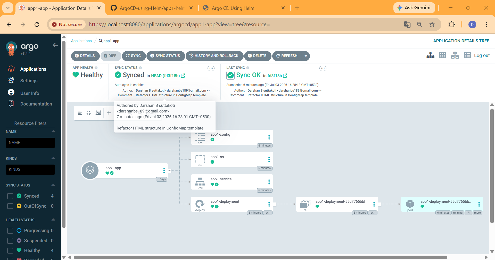

## About the Project


This project demonstrates how **Argo CD** integrates with **Helm** to implement a GitOps-based deployment workflow for Kubernetes applications.

The application is packaged as a **Helm chart**, which contains reusable Kubernetes templates for resources such as a Namespace, ConfigMap, Deployment, and Service. The chart uses `values.yaml` to separate configuration from templates, making the application easier to customize and maintain across different environments.

Unlike a traditional Helm deployment, **Argo CD does not use Helm to install or manage releases**. Instead, Argo CD uses Helm solely as a **manifest rendering tool**. During synchronization, Argo CD executes `helm template` to render the Helm templates into standard Kubernetes YAML manifests. These generated manifests are then compared with the current state of the Kubernetes cluster, and any differences are automatically reconciled to ensure the cluster matches the desired state stored in the Git repository.

This approach combines the flexibility of Helm templating with the declarative and automated deployment capabilities of Argo CD, enabling a reliable, version-controlled, and continuously synchronized deployment process.

### Workflow

```text
GitHub Repository
        │
        ▼
    Helm Chart
        │
        ▼
Argo CD fetches the chart
        │
        ▼
Runs "helm template"
        │
        ▼
Generates Kubernetes Manifests
        │
        ▼
Compares with Cluster State
        │
        ▼
Applies Required Changes
        │
        ▼
Kubernetes Cluster
```

### Key Features

- Demonstrates GitOps-based application deployment using Argo CD.
- Uses Helm charts to create reusable and parameterized Kubernetes manifests.
- Separates application configuration using `values.yaml`.
- Automatically synchronizes Kubernetes resources with the desired state stored in Git.
- Illustrates the role of Helm as a **manifest rendering tool** rather than a deployment tool when used with Argo CD.
- Includes Kubernetes resources such as Namespace, ConfigMap, Deployment, and Service.

### Learning Outcomes

By completing this project, you will understand:

- GitOps principles and workflow.
- Helm chart structure and templating.
- Configuration management using `values.yaml`.
- How Argo CD integrates with Helm.
- The difference between `helm install` and `helm template`.
- Continuous synchronization and declarative application management in Kubernetes.
